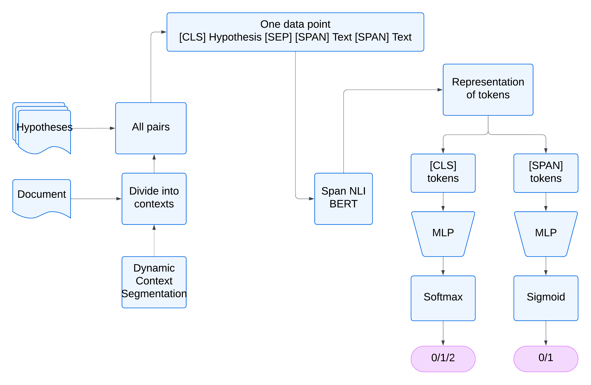

# Contract NLI

## Problem Statement:

- The task is to perform document-level Natural Language Inference (NLI) on legal contracts, where the premise is a given contract, and the hypothesis is a claim about the contract. The goal is to determine whether the hypothesis is entailed by, contradicts, or is neutral to the contract. Additionally, for entailment or contradiction cases, the relevant span in the contract that serves as evidence must be identified.

## Dataset:

- The paper presents the largest dataset of annotated contracts to date, consisting of 607 contracts paired with hypotheses. For each hypothesis, the contract text is labeled with one of three categories (entailment, contradiction, or neutral) and accompanied by evidence spans supporting the classification.

- We have used 607 annotated contracts, the largest dataset available.
#### Split into : 
- Train Set : 423 Contracts
- Dev Set : 61 Contracts
- Test Set : 123 Contracts

#### The basic structure in all files contains a list of documents. Each document has several attributes, such as:
- id: Unique identifier for the document.
- file_name: Name of the file (usually a legal document like NDA).
- text: Full text content of the document.
- spans: Indices or ranges within the text that are marked for specific purposes.
- annotation_sets: Additional metadata, possibly marking certain phrases or spans within the text for classification.

#### Data Annotations : 

- Dataset contains 17 hypothesis.
- Each document is mapped with this 17 hypothesis.
- Each document contains several predefined spans.
- Each of these hypothesis is mapped to corresponding spans.

### Baseline Models
- Majority Vote
- Doc TF-IDF + SVM (Support Vector Machine)
- Span TF-IDF + Cosine Similarity
- Span TF-IDF + SVM

## Approach 

- Span-NLI BERT model to handle both NLI classification and span detection in a unified architecture. BERT-based models have revolutionized NLP tasks due to their ability to capture contextualized word representations, making them particularly suitable for tasks like NLI and evidence span detection, especially in legal language where context is paramount.
- Span-NLI BERT will combine the strengths of pre-trained language models (BERT) and task-specific fine-tuning to jointly address both NLI classification and span detection.
- The model will likely improve over the current baselines by considering deeper semantic and syntactic features within contract documents.
- Additionally, BERT can better handle the nuances in contract language, such as complex clauses, paraphrasing, and indirect references, making it more robust for this task.
- We anticipate that Span-NLI BERT will significantly enhance both NLI classification and evidence span identification, outperforming the current TF-IDF and SVM-based baselines.

## Files and Folders
#### data :
- Contains Train,Test and Dev datasets
#### baselines :
- Code for all baselines and its readme
#### span_nli_bert :
- Code for span nli vert model

